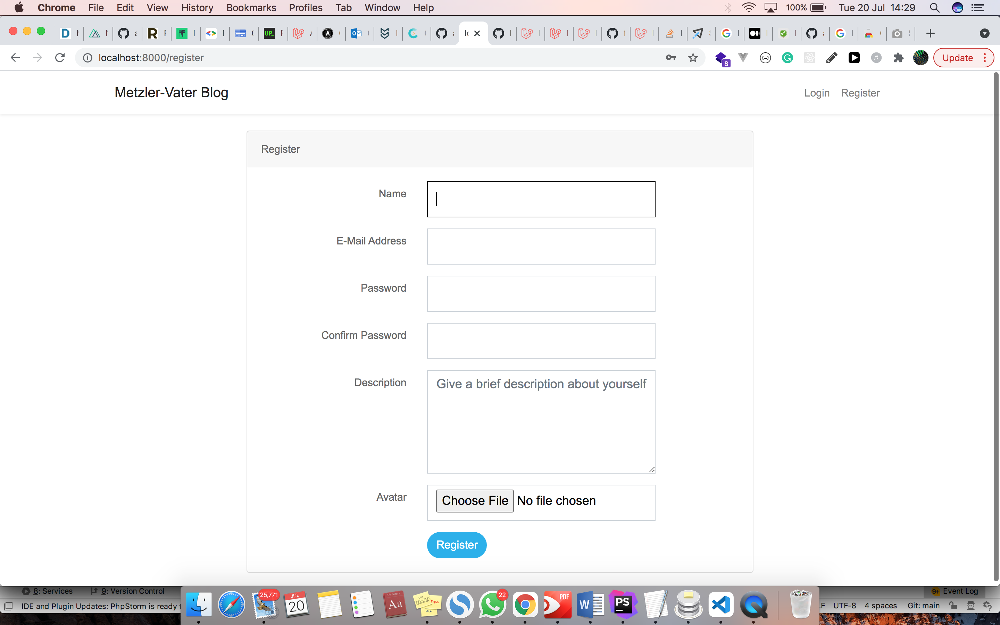

# Blog

Overview
--------
This is a simple blogging application that contain the following features:

- Guest area:
    - List posts
    - View post
- Authenticated Area:
    - User authentication (Login)
    - Posts:
        - List posts
        - Create post
        - Edit post
        - Delete post
- Users:
    - List users
    - Create user
    - Edit user
    - Delete user

There are two kinds of registered users:
- **Ordinary user**
    - An ordinary user can:
        - add new post
        - edit only their own posts
        - delete only thier own posts
        - edit only thier own information
        - They can view another user
    - An ordinary user cannot:
        - delete their own or other accounts
        - view list of all users

- **Admin user**
    - An admin can:
        - perform all actions an ordinary user is capable of
        - create users
        - edit users
        - delete users

Tech Stack
------------
- Laravel 7
- Laravel Dusk
- Bootstrap 4

Setup:
-------------
- Clone the project: ```git clone https://github.com/atunjeafolabi/metzler-vater-blog.git```
- Create a mysql database named ```blog```
- Make a copy of ```.env.example``` and name it as ```.env```, then fill it with the database credentials (username and password).
- Create the following folders in `storage/app/public/`: 
    - avatar
    - post-image
    - test/avatar
    - test/post-image
    >The test images generated by Faker when seeding the database are stored in the `test/*` directory in `storage/app/public/`
- From the project root directory, run `composer install`
- Create a symbolic link with `php artisan storage:link` to make the contents in the `storage/app/public` directory publicly accessible
- Generate an app key with `php artisan key:generate`
- Run migrations with seeders ```php artisan migrate --seed```
- Start local dev server: ```php artisan serve --port=8000``` 

Usage
----
Visit the local homepage at `localhost:8000` 

### Screenshots

##### All Posts


##### View one post


##### Add Post


##### Add user (Admin)


##### View all users (Admin)


##### View user (Admin)


##### Register


##### Login


Running Test:
------------
- Create a sqlite database file named `test-database.sqlite` in the database folder of the Laravel application.
- Ensure that `.env.dusk` is included in the root of the aplication
- Start test server on another port using `php artisan serve --env=dusk --port=8001`
- Run ```php artisan dusk```

If you have any issue running tests that require an image upload, check that you have the `zip` PHP Extension installed and enabled on your computer as indicated in the [Laravel Docs](https://laravel.com/docs/8.x/dusk#attaching-files).

Additional Features
-------------------
- Recent posts (latest five)
- Admin user
- Post categories

Future Works
------------
- Implement search functionality
- Improve User interface
- Add more tests

Issues
------
- If you face any difficulty in setting this project up locally or have other issues, kindly create a github [issue](https://github.com/atunjeafolabi/metzler-vater-blog/issues).

